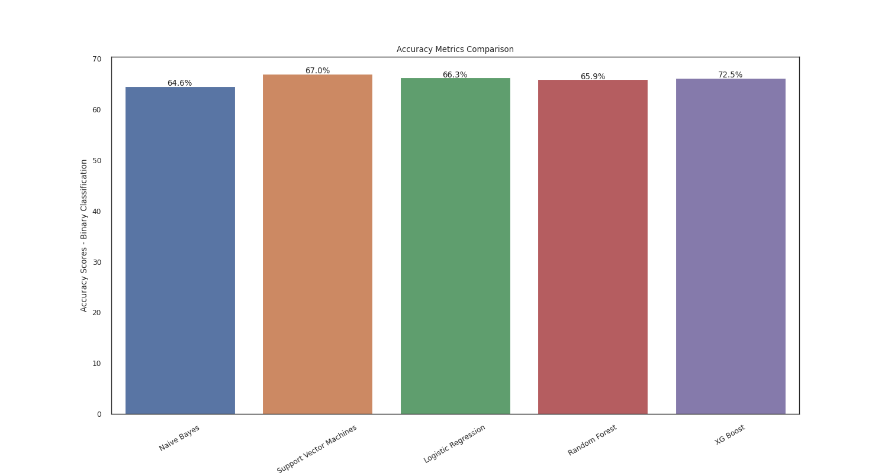
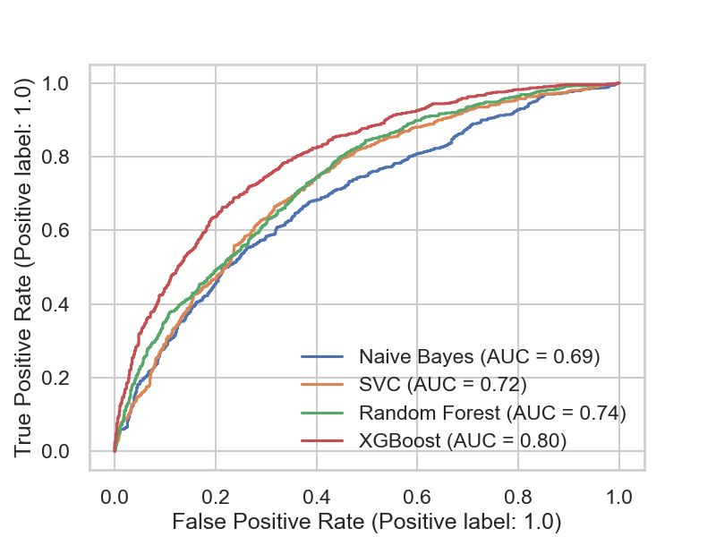
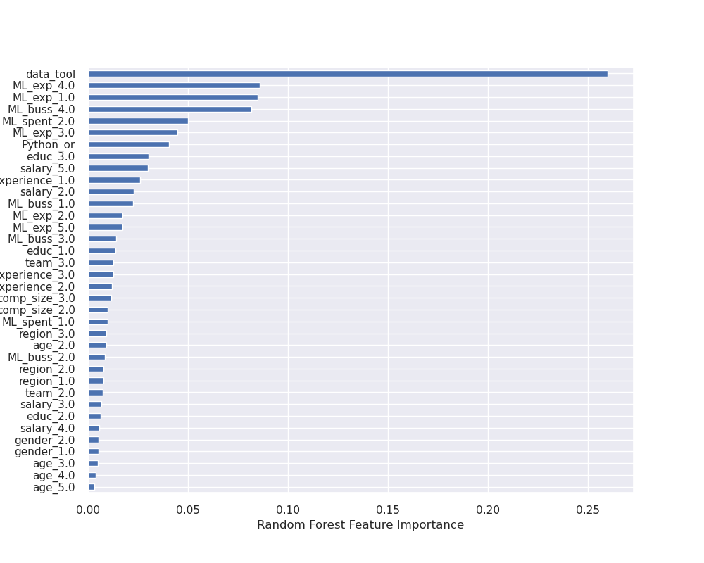
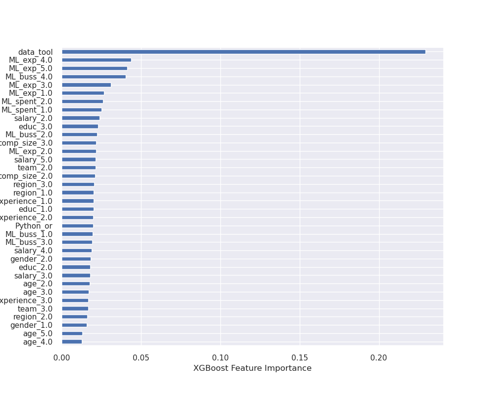

# Traits of People in Data Careers

## Data Scientists vs. Others

The project is about understanding the differential traits of data scientists from other data-related job titles (e.g., data analyst, data engineer, and machine learning engineer). The features include socio-economic characteristics, programming experiences, programming language preferences, and company-level characteristics. The data is downloaded from Kaggle, and the title is the 2020 Kaggle Data Science & Machine Learning Survey.

My analysis includes EDA and finding the best predictive model for the binary classification problem (data scientist vs. non-data scientist). 
In terms of accuracy metrics and roc curve performance, XGBoost gives the best predictive model. 

## Model Evaluation Metrics

Random Forest and XGBoost algorithms give consistent results about feature importance. The most important feature is related to the data science tools employed by data scientists. Data scientists use overwhelmingly local development environments (RStudio, Jupyter lab, etc.), and they are experienced in machine learning methods experience at senior (5-10 years) and lead (20 or more years) levels. As a result of their ML experience, they tend to work at ML-invested companies where companies are well established in ML methods (i.e., models in production for more than two years). Both algorithms consistently highlight that socio-economic features do not have a high predictive power on job titles in the tech industry.

